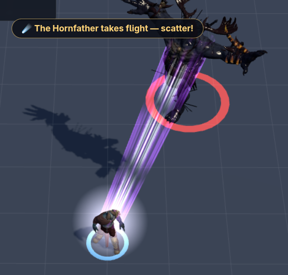
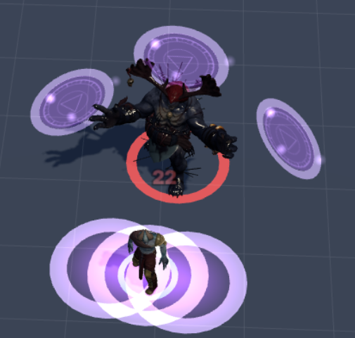
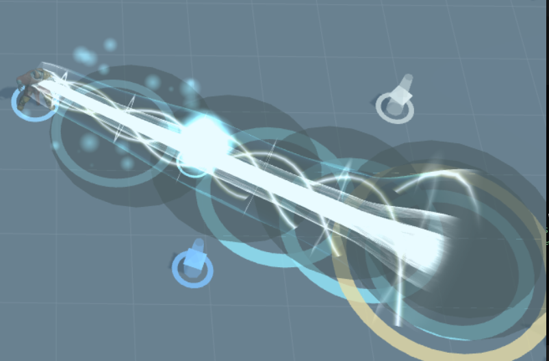

# ⚔️ 3jsgame — Three.js Isometric ARPG

A tiny Diablo-like: kill, loot, portal, repeat. Single-player prototype built with
**Three.js + TypeScript + Vite**. UI is an HTML overlay; 3D is Three.js only.

**🎮 Play it now: https://elvisrepo.github.io/three/** (free, no install)

## Screenshots

| The Hornfather takes flight — scatter! | Void rifts + damage | Storm Lance beam |
| --- | --- | --- |
|  |  |  |

## The loop

Title → hero select/create (Warrior / Archer / Mage, x1–x10 EXP rate) → Haven
(shop + portal) → Greenmeadow 1–10 + boss → Crypt 10–20 + boss → Ember Wastes
20–30 + boss → Howling Wilds 30–40 + the Hornfather → endgame rifts.

Lv10 job advancement (6 jobs), Lv20 ultimates, quests, elites, shared stash,
remappable keys, and exportable/importable saves.

## Run it locally

```sh
npm install
npm run dev    # play at http://localhost:5173
npm run build  # typecheck + production build (must pass before finishing)
```

## Controls

Click monster: attack · click ground: move · **1–7** skills · **Q** potion ·
**I** bag · **C** character · **J** quests · **E** blink · **Space** dodge ·
**T** town portal · **WASD** move · wheel zoom · **Esc** pause/menu.

## Saves

Heroes live in browser `localStorage` (`arpg.chars.v1`), autosaved on zone
change / level up / every 30s. Use the hero screen to export/import as JSON.

## Docs

- Design + backlog: [`ARPG_PLAN.md`](ARPG_PLAN.md) (check §16 before proposing next steps)
- Contributor guide: [`AGENTS.md`](AGENTS.md)
- System diagrams: [`docs/diagrams/`](docs/diagrams/)
