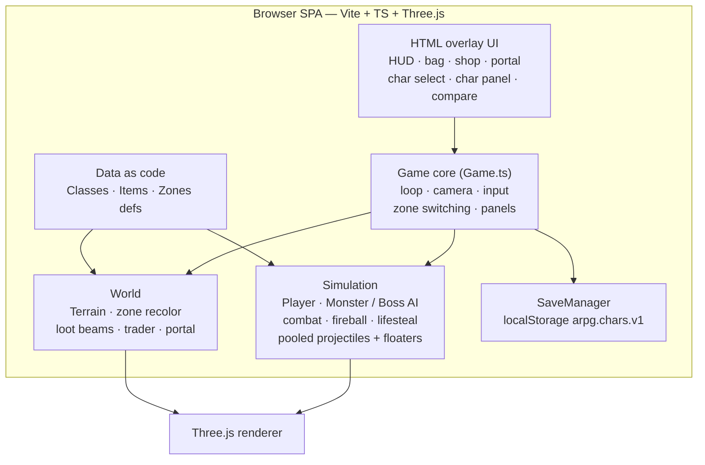
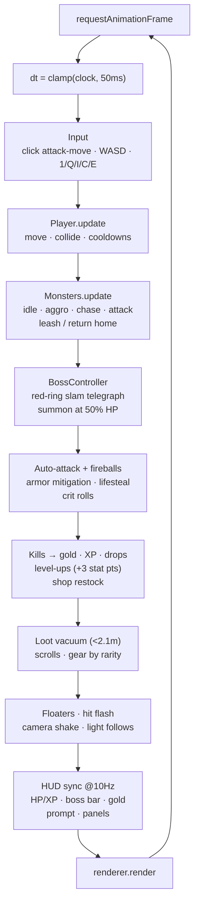
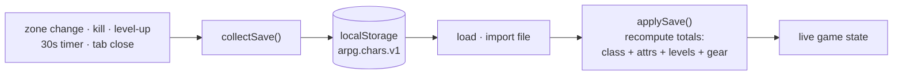
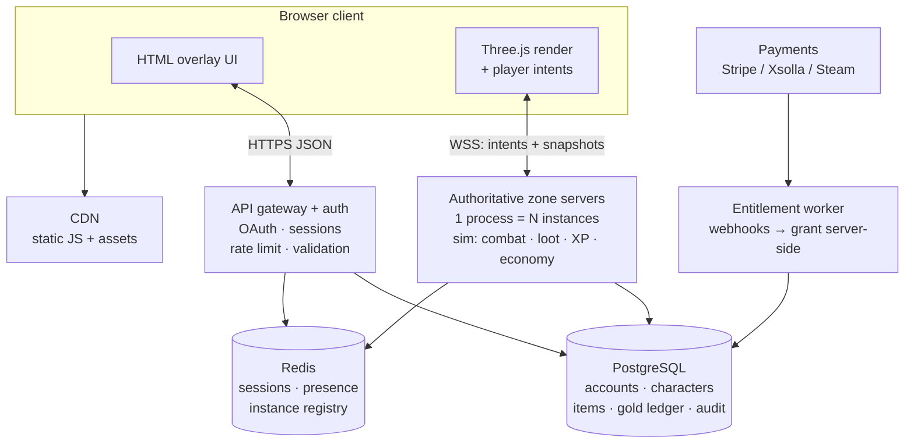
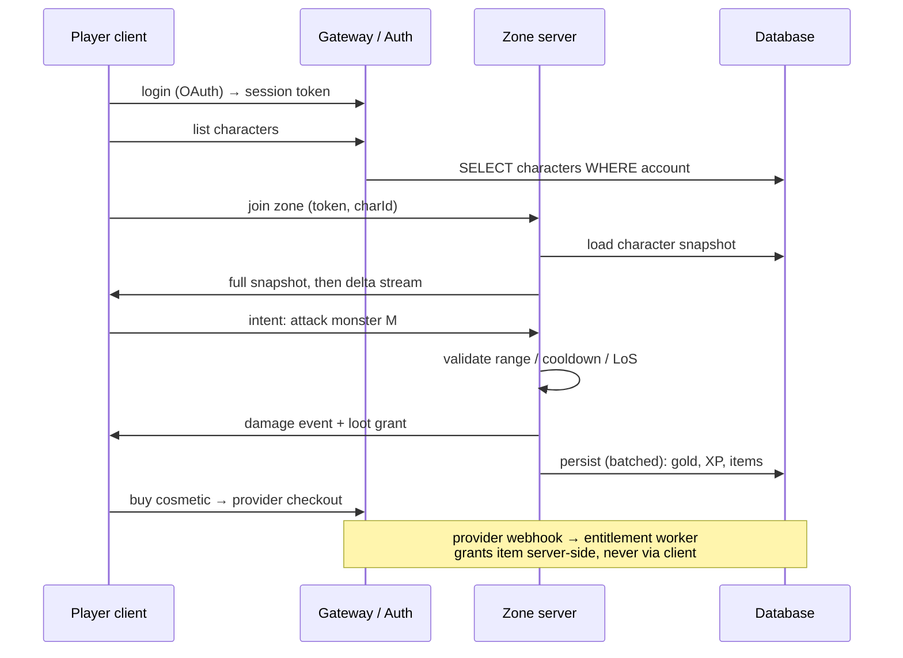
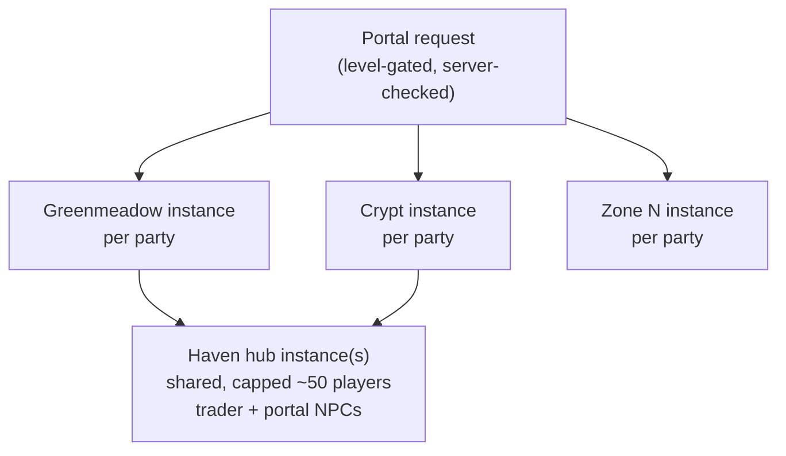
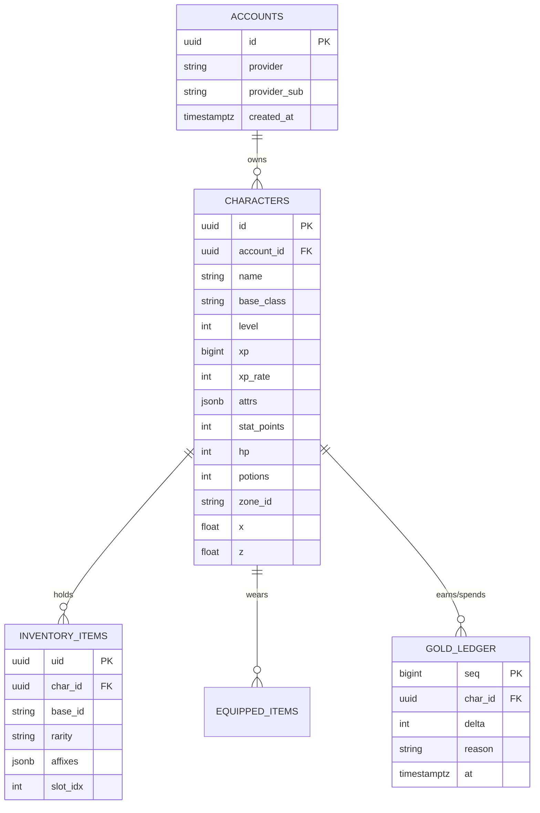

# 3jsgame — System Design (MVP + Full)

Diagrams live here as **Mermaid** (renders on GitHub; VS Code: Markdown Preview Mermaid Extension).
Exported images (PNG/SVG), if ever needed, go beside the `.md` that embeds them.

- [1. MVP (built today — single-player, client-only)](#1-mvp-built-today--single-player-client-only)
- [2. Full (future — accounts, multiplayer, payments)](#2-full-future--accounts-multiplayer-payments)
- [3. Data model: save file → database tables](#3-data-model-save-file--database-tables)
- [4. Migration path MVP → Full](#4-migration-path-mvp--full)

---

## 1. MVP (built today — single-player, client-only)

Everything runs in the browser. No backend, no accounts. Persistence = `localStorage` key
`arpg.chars.v1` behind the `SaveManager` interface.

Rules this diagram encodes (see `AGENTS.md`):

- Sim code never touches the DOM — only `Game.ts` writes UI.
- Transient objects are pooled (`ProjectilePool`, `DamageNumbers`) or disposed (`LootManager`).
- Content is data (`Zones.ts`, `Items.ts`, `Classes.ts`), not `if zone === 3` branches.

### Game loop (per frame)

### Save flow

Key property: derived totals are **recomputed**, never trusted from disk
(`refreshAttributes()` / `refreshGear()` are delta-applied). That habit is what later lets a
server be the source of truth without redesigning combat.

---

## 2. Full (future — accounts, multiplayer, payments)

Client gets thinner (render + intents); a Node backend becomes authoritative for everything of
value. See `ARPG_PLAN.md` §15 for the product reasoning.

Never-trust-the-client boundary: gold deltas, item grants, shop prices, portal gates and XP
are computed in `GS`, persisted to `DB`, and only then shown by the client.

### Zone session (sequence)

### Instance model

Parties share a seed/instance id; solo play is just a party of one — which is why MVP avoids
"exactly one player" assumptions in loot, damage numbers, and AI targeting.

---

## 3. Data model: save file → database tables

`CharacterSave` (versioned, `SAVE_VERSION`) maps almost 1:1 to future tables:

Notes:

- Items already carry UIDs (`makeUid()`) — they become primary keys; duping is detectable.
- Gold as an append-only ledger (not a mutable column) makes rollback and fraud review possible.
- MVP `export/import hero file` is the prototype of GDPR export; account deletion = cascade delete.

---

## 4. Migration path MVP → Full

| Step | What changes | What stays untouched |
|---|---|---|
| 1. Backend saves | `SaveManager` gains a remote implementation; local stays as offline cache | `CharacterSave` shape, versioning |
| 2. Auth | Title screen adds login; `currentSaveId` becomes server id | Char select / create UX |
| 3. Authoritative sim | `Monster`/`Boss`/damage math move server-side; client keeps rendering + prediction-lite | Data defs (`Zones`, `Items`, `Classes`), tuning numbers |
| 4. Economy guard | Shop/portal/drop rolls validated server-side | Client UI flows |
| 5. Payments | Checkout + webhook worker; cosmetics only | Combat balance |

Non-goals for migration: rewriting the renderer, the HTML UI layer, or the content defs.
